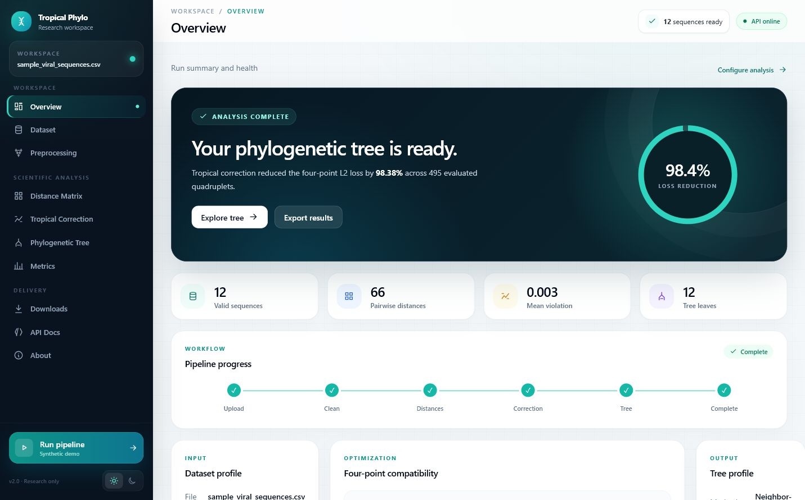

# 🧬 Tropical Virus PhyloTree MLOps

[](https://github.com/Noum-svg/tropical-virus-phylo-mlops/actions/workflows/ci.yml)


Transform viral RNA/DNA sequences (CSV) into an **optimized phylogenetic tree** by
learning a *tropical correction* of a sequence distance matrix and then running
Neighbor-Joining. It ships with a professional **React** dashboard, a **FastAPI**
service, a **Streamlit** app, and one-command **Docker** deployment.



> ⚠️ **Non-diagnostic research tool.** This project analyzes viral sequence
> relationships and reconstructs trees for computational-biology, research, and
> educational purposes. It is **not** a medical diagnostic system and must not
> be presented as diagnosing infection or disease. Reducing tropical
> four-point violations improves mathematical compatibility with an additive
> tree metric; it does **not** prove the inferred topology is the true
> evolutionary history.

> 🚫 **No synthetic data as results.** Real viral sequences are never
> fabricated. If the input CSV is missing, the pipeline raises a clear error
> telling you to provide real data or run the NCBI scraper. (Small toy
> sequences inside `tests/` are unit-test inputs only.)

## The math

The pipeline learns a symmetric, zero-diagonal correction $\omega$ and forms the
corrected distance matrix

```math
X = D + \omega
```

where $D$ is the initial sequence-distance matrix. $\omega$ is optimized to reduce
the **tropical four-point violations** of $X$; Neighbor-Joining then reconstructs
the tree from $X$. The distance matrix is an internal artifact — the **tree**
(Newick + edge list + DOT) is the deliverable.

### Sequence distance

For cleaned sequences $s_i, s_j$ with lengths $L_i, L_j$ and shared length
$L_{ij} = \min(L_i, L_j)$, the normalized Hamming term $H$ and the length
penalty $P$ combine into the distance $d \in [0, 1]$:

```math
H(s_i, s_j) = \frac{1}{L_{ij}} \sum_{k=1}^{L_{ij}} \mathbf{1}[\, s_i(k) \neq s_j(k) \,],
\qquad
P(s_i, s_j) = \frac{| L_i - L_j |}{\max(L_i, L_j)}
```

```math
d(s_i, s_j) = \alpha \, H(s_i, s_j) + (1 - \alpha)\, P(s_i, s_j), \qquad \alpha = 0.9
```

### Tropical four-point violation

For each quadruplet $i < j < k < l$ of a symmetric matrix $X$, form the three
pairwise sums and take the gap between the largest two:

```math
S_1 = X_{ij} + X_{kl}, \qquad S_2 = X_{ik} + X_{jl}, \qquad S_3 = X_{il} + X_{jk}
```

```math
\delta_{ijkl}(X) = \max(S_1, S_2, S_3) - \mathrm{secondmax}(S_1, S_2, S_3) \; \ge \; 0
```

The quadruplet is **tree-compatible** exactly when $\delta_{ijkl}(X) = 0$ (the
maximum is attained at least twice).

### Objective and optimizer

Let $Q$ denote the evaluated quadruplets and let $g$ be the current
subgradient. Define the tropical gradient spread

```math
T(g) = \max(g) - \min(g).
```

The correction minimizes the total squared violation with an explicit squared
matrix penalty:

```math
L(\omega) = \sum_{q \in Q} \delta_q(D + \omega)^2
            + \lambda \sum_{i,j} \omega_{ij}^2.
```

The optimizer normalizes its subgradient step by $T(g)$:

```math
\omega_{t+1} = \omega_t
               - \frac{\gamma}{T(g_t) + \varepsilon} g_t.
```

The improvement reported after correction is the relative drop in the squared
four-point loss $L_2(M)=\sum_{q\in Q}\delta_q(M)^2$:

```math
\mathrm{RI} = \frac{L_2(D) - L_2(X)}{L_2(D) + \varepsilon}
```

## Project layout

```
src/         scientific core (pure, typed, documented functions)
api/         FastAPI app (orchestration only)
app/         Streamlit dashboard (orchestration only)
tests/       pytest suite
data/raw/    real input CSV (git-ignored; never committed)
outputs/     generated matrices, omega, history, metrics, trees, figures (git-ignored)
params.yaml  central configuration (loaded once, passed down)
```

## Setup

```bash
python -m pip install -r requirements.txt
```

## Run the tests

```bash
python -m pytest -q          # all green
black --check . && ruff check .
```

## Run the pipeline

The pipeline requires **real** data at `data/raw/multi_virus_rna_sequences_100.csv`
(`virus_name,rna_sequence`). If it is absent, the run raises a clear error —
sequences are never fabricated. Acquire real data from NCBI, or run on the
bundled clearly-labeled **synthetic** demo:

```bash
# Real data (place the CSV first, or fetch it):
python -m src.scraper_ncbi --query "Influenza A virus[Organism] AND complete genome" --max-records 100
python main.py                       # full pipeline end-to-end
#   OR rebuild via DVC stages:
dvc repro

# Quick local run on the synthetic demo (not a scientific result):
python main.py --demo --no-mlflow
```

Artifacts land in `outputs/` (`distance_matrix.csv`, `corrected_distance_matrix.csv`,
`omega.csv`, `history.csv`, `metrics.json`, `figures/*.png`, `trees/tree_after.{newick,csv,dot}`)
and `models/omega.npy`; a report is written to `reports/evaluation_report.md`.

## Run locally with Docker (recommended)

The professional **React** dashboard is built and served by the app. With Docker
Desktop running (the image build compiles the frontend automatically):

```bash
docker compose up --build
```

Then open:

- **http://localhost:8000** — the professional React web UI (upload a CSV or use
  the synthetic demo, run the pipeline, explore the distance-matrix heatmap, loss
  curve, corrected matrix, the clade-coloured phylogenetic tree, metrics, and
  downloads).
- **http://localhost:8000/docs** — interactive API docs.
- **http://localhost:8501** — the secondary Streamlit dashboard.

Stop with `docker compose down`. `data/`, `outputs/`, and `models/` are mounted
so runs persist on your machine.

Compose builds the shared application image once through the API service; the
Streamlit service reuses that image and starts through `python -m streamlit`.

## Frontend (React + Vite + TypeScript + Tailwind)

The professional UI lives in [`frontend/`](frontend/). The API serves the built
app from `frontend/dist` when present, otherwise it falls back to the no-build
static UI in `web/`. To build or develop it:

```bash
cd frontend
npm install
npm run build      # outputs frontend/dist, served by FastAPI at http://localhost:8000
npm run dev        # OR a hot-reload dev server (proxies the API at :8000)
```

It calls the API's `/pipeline`, `/tree-image`, and other endpoints, renders charts
with Recharts, and shows the server-rendered tree image. It orchestrates the API
only — no math in the frontend.

The responsive application shell includes grouped scientific navigation,
accessible light and dark themes, explicit loading and error states, mobile
navigation, interactive matrix views, tree controls, and artifact export cards.

## API and dashboards (without Docker)

```bash
uvicorn api.main:app --reload        # React UI (if built) at http://127.0.0.1:8000 ; docs at /docs
streamlit run app/streamlit_app.py   # secondary dashboard at http://127.0.0.1:8501
mlflow ui                            # browse logged runs (after a training run)
```

## Documentation

- [`docs/mathematics.md`](docs/mathematics.md) — the math as implemented (with notes on two deliberate deviations from the draft spec: α-weighted distance; a *normalized* tropical-norm optimizer step, since the literal `γ·‖g‖/√p` diverges).
- [`docs/architecture.md`](docs/architecture.md) — module map and dependency direction.
- [`docs/api.md`](docs/api.md) — endpoint reference.

## Status

Complete: core math, four-point engine, Hybrid tropical gradient descent,
Neighbor-Joining + tree export, orchestration (`predict`/`train`/`evaluate`),
FastAPI (7 endpoints), Streamlit dashboard (10 pages), optional NCBI scraper,
DVC pipeline, MLflow logging, and CI. Full `pytest` suite green.
